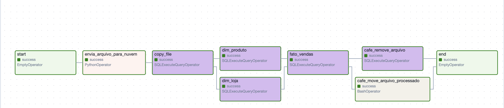
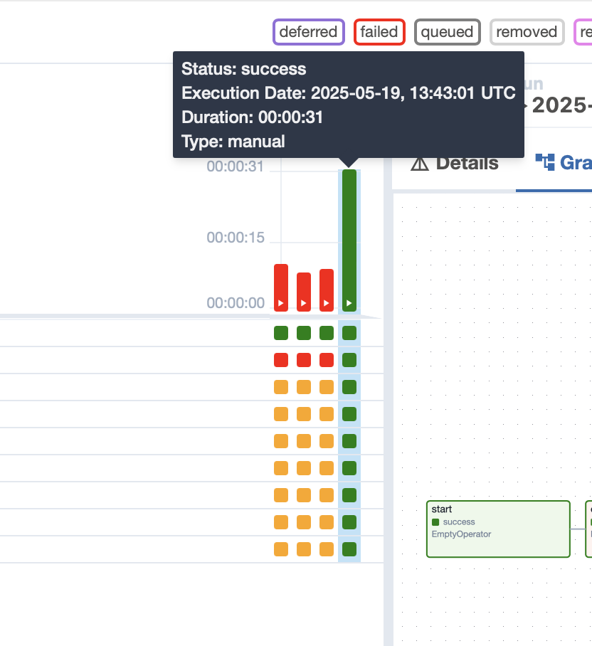

# ☕ Projeto de Data Warehouse da Cafeteria com Airflow e Snowflake

Este projeto tem como objetivo criar um processo automatizado com o **Apache Airflow** para fazer o **upload de arquivos para o Snowflake**, estruturando um **Data Warehouse (DW)** com base nos dados da cafeteria e respondendo a perguntas analíticas.

---

## 🎯 Objetivos

- Criar uma **DAG no Airflow** para automatizar:
  - Upload dos arquivos `.csv` para o Snowflake;
  - Criação e carga das tabelas dimensionais e fato;
  - Execução de queries para responder perguntas de negócio.

- Construir um **Data Warehouse** com base nos arquivos da cafeteria.

---

## 🗂️ Estrutura do Data Warehouse

### 📅 Dimensão Data (`dim_date`)
```sql
create or replace TABLE IMPACTA.CAFE.DIM_DATE (
	FULL_DATE DATE,
	DAY_OF_WEEK VARCHAR(20),
	DAY NUMBER(38,0),
	MONTH NUMBER(38,0),
	YEAR NUMBER(38,0),
	QUARTER NUMBER(38,0),
	IS_HOLIDAY BOOLEAN
);
```


### 📦 Dimensão Produto (dim_produto)

```sql
create or replace TABLE IMPACTA.CAFE.DIM_PRODUTO (
	PRODUCT_ID NUMBER(38,0) NOT NULL,
	PRODUCT_CATEGORY VARCHAR(16777216),
	PRODUCT_TYPE VARCHAR(16777216),
	PRODUCT_DETAIL VARCHAR(16777216),
	SIZE VARCHAR(16777216),
	primary key (PRODUCT_ID)
);
```

### 🏪 Dimensão Loja (dim_loja)

```sql
create or replace TABLE IMPACTA.CAFE.DIM_LOJA (
	STORE_ID NUMBER(38,0) NOT NULL,
	STORE_LOCATION VARCHAR(16777216),
	primary key (STORE_ID)
);
```

### 📊 Tabela Fato Vendas (fato_vendas)

```sql
create or replace TABLE IMPACTA.CAFE.FATO_VENDAS (
	TRANSACTION_ID NUMBER(38,0) NOT NULL,
	TRANSACTION_DATE DATE,
	PRODUCT_ID NUMBER(38,0),
	STORE_ID NUMBER(38,0),
	TRANSACTION_QTY NUMBER(38,0),
	UNIT_PRICE NUMBER(38,1),
	TOTAL_BILL NUMBER(38,1),
	MONTH NUMBER(38,0),
	MONTH_NAME VARCHAR(16777216),
	HOUR NUMBER(38,0),
	DAY_NAME VARCHAR(16777216),
	primary key (TRANSACTION_ID),
	foreign key (PRODUCT_ID) references IMPACTA.CAFE.DIM_PRODUTO(PRODUCT_ID),
	foreign key (STORE_ID) references IMPACTA.CAFE.DIM_LOJA(STORE_ID)
);
```
## ---------------------------------------------------------------------

# Perguntas Analíticas

Abaixo contém as **perguntas analíticas** sobre as vendas da cafeteria encontradas no enunciado. Segue as perguntas juntamente com suas **consultas SQL correspondentes**, baseadas nos dados modelados no **Data Warehouse no Snowflake**.


## 1. 📅 Qual o produto mais vendido a cada mês?

```sql
SELECT 
    ve.Month_Name AS mes, 
    ve.product_id AS id_produto, 
    pr.product_category AS categoria_produto,
    SUM(ve.transaction_qty) AS total_quantidade
FROM IMPACTA.CAFE.FATO_VENDAS ve 
LEFT JOIN IMPACTA.CAFE.DIM_PRODUTO pr 
    ON pr.product_id = ve.product_id
GROUP BY ve.Month_Name, ve.product_id, pr.product_category, ve.MONTH
QUALIFY ROW_NUMBER() OVER (
    PARTITION BY ve.Month_Name 
    ORDER BY SUM(ve.transaction_qty) DESC
) = 1
ORDER BY ve.MONTH ASC;
```

### resposta:


| Mês      | ID do Produto | Categoria do Produto   | Total de Quantidade |
|----------|----------------|-------------------------|----------------------|
| January  | 27             | Coffee                  | 551                  |
| February | 44             | Tea                     | 542                  |
| March    | 50             | Tea                     | 685                  |
| April    | 59             | Drinking Chocolate      | 833                  |
| May      | 50             | Tea                     | 1075                 |
| June     | 50             | Tea                     | 1109                 |


## 2. 🏪 Qual a loja que mais vende a cada mês?

```sql
SELECT 
    ve.Month_Name AS mes, 
    lo.store_location AS local_loja,
    SUM(ve.transaction_qty) AS total_transacoes
FROM IMPACTA.CAFE.FATO_VENDAS ve 
LEFT JOIN IMPACTA.CAFE.DIM_LOJA lo 
    ON lo.store_id = ve.store_id
GROUP BY ve.Month_Name, lo.store_location, ve.MONTH
QUALIFY ROW_NUMBER() OVER (
    PARTITION BY ve.Month_Name 
    ORDER BY SUM(ve.transaction_qty) DESC
) = 1
ORDER BY ve.MONTH ASC;
```

### resposta:


| Mês      | Local da Loja     | Total de Transações |
|----------|-------------------|----------------------|
| January  | Hell's Kitchen    | 8.340                |
| February | Hell's Kitchen    | 7.937                |
| March    | Lower Manhattan   | 10.209               |
| April    | Lower Manhattan   | 12.249               |
| May      | Lower Manhattan   | 16.175               |
| June     | Hell's Kitchen    | 17.124               |


## 3. 📐 Quais os tamanhos mais comprados de produtos a cada mês?

```sql
SELECT 
    ve.Month_Name AS mes, 
    pr.size AS tamanho,   
    SUM(ve.transaction_qty) AS total_quantidade
FROM IMPACTA.CAFE.FATO_VENDAS ve 
LEFT JOIN IMPACTA.CAFE.DIM_PRODUTO pr 
    ON pr.product_id = ve.product_id
GROUP BY ve.Month_Name, ve.product_id, pr.size, ve.MONTH
QUALIFY ROW_NUMBER() OVER (
    PARTITION BY ve.Month_Name 
    ORDER BY SUM(ve.transaction_qty) DESC
) = 1
ORDER BY ve.MONTH ASC;
```

### resposta:


| Mês      | Tamanho | Total de Quantidade |
|----------|---------|----------------------|
| January  | Large   | 551                  |
| February | Regular | 542                  |
| March    | Regular | 685                  |
| April    | Large   | 833                  |
| May      | Regular | 1075                 |
| June     | Regular | 1109                 |


## 4. ⏰ Qual o volume de vendas por horário?

```sql
SELECT 
    ve.Month_Name AS mes,
    ve.transaction_date AS data_transacao,
    ve.hour AS hora,
    SUM(ve.transaction_qty) AS total_quantidade
FROM IMPACTA.CAFE.FATO_VENDAS ve 
GROUP BY ve.Month_Name, ve.transaction_date, ve.hour, ve.MONTH
ORDER BY ve.MONTH, ve.transaction_date, ve.hour ASC;
```

### resposta:


| MES     | DATA_TRANSACAO | HORA | TOTAL_QUANTIDADE |
|---------|----------------|------|------------------|
| January | 2023-01-01     | 7    | 26               |
| January | 2023-01-01     | 8    | 26               |
| January | 2023-01-01     | 9    | 59               |
| January | 2023-01-01     | 10   | 39               |
| January | 2023-01-01     | 11   | 75               |
| January | 2023-01-01     | 12   | 83               |
| January | 2023-01-01     | 13   | 97               |
| January | 2023-01-01     | 14   | 72               |
| January | 2023-01-01     | 15   | 64               |
| January | 2023-01-01     | 16   | 61               |
| January | 2023-01-01     | 17   | 77               |
| January | 2023-01-01     | 18   | 74               |
| January | 2023-01-01     | 19   | 49               |

**Obs**: foram trazidos somente algumas linhas

## 5. 💰 Qual o total de vendas por mês?

```sql
SELECT 
    ve.Month_Name AS mes,    
    SUM(ve.total_bill) AS total_vendas   
FROM IMPACTA.CAFE.FATO_VENDAS ve 
GROUP BY ve.Month_Name, ve.MONTH
ORDER BY ve.MONTH ASC;
```
### resposta:


| MES      | TOTAL_VENDAS |
|----------|--------------|
| January  | 81,840.0     |
| February | 76,299.4     |
| March    | 99,036.6     |
| April    | 119,175.9    |
| May      | 157,042.3    |
| June     | 166,812.8    |


## ---------------------------------------------------------------------

# Dag

O código 01_cafe.py está em anexo no repositório. Abaixo segue a estrutura da dag e a comprovação gráfica da execução com sucesso com as informações de data, duração e status.



